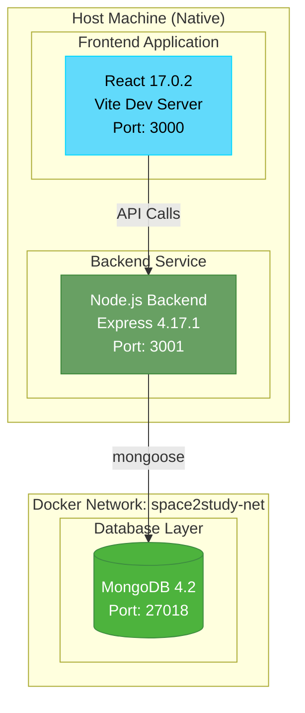
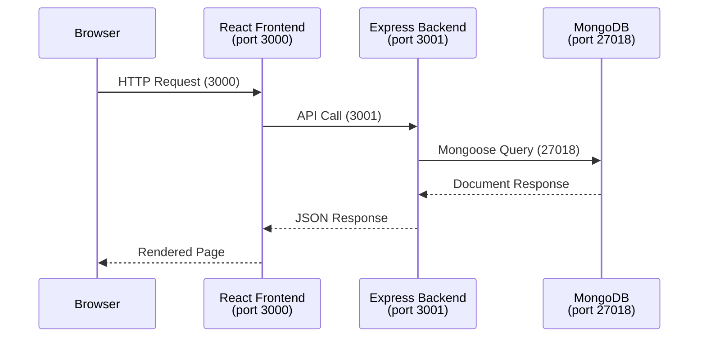
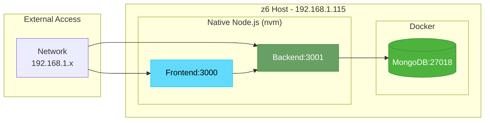
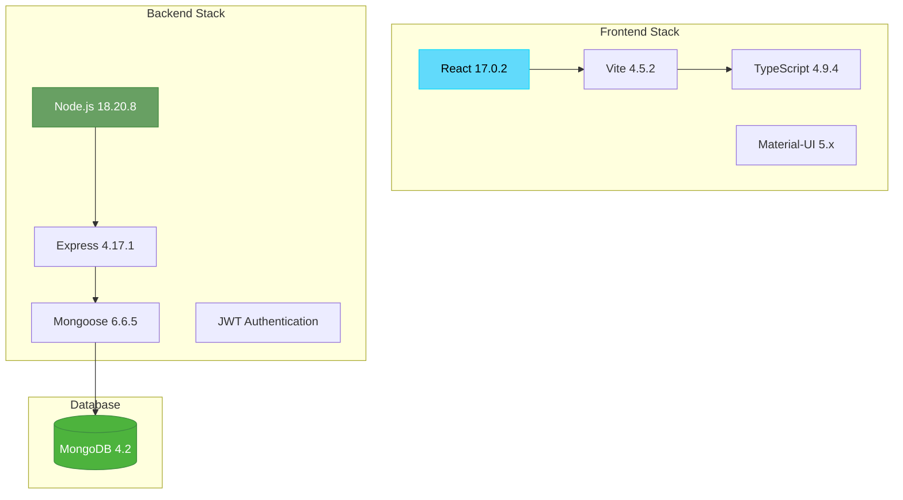

# Task 1: Setup a Webapp - Completion Report

**Project:** Space2Study
**Status:** COMPLETED
**Date:** January 6, 2026
**Environment:** z6 workstation (192.168.1.115)

---

## Architecture Overview



## Service Communication Flow



## Infrastructure Topology



## Technology Stack



## Services Status

| Service | Container/Process | Port | Status | Access URL |
|---------|-------------------|------|--------|------------|
| MongoDB | space2study-mongodb (Docker) | 27018 | Running | mongodb://localhost:27018 |
| Backend | Node.js native (npm start) | 3001 | Running | http://localhost:3001 |
| Frontend | Vite dev server (npm start) | 3000 | Running | http://localhost:3000 |

## Access URLs

| Service | Local Access | Network Access |
|---------|--------------|----------------|
| Frontend | http://localhost:3000 | http://192.168.1.115:3000 |
| Backend API | http://localhost:3001 | http://192.168.1.115:3001 |
| MongoDB | localhost:27018 | 192.168.1.115:27018 |

## Files Created/Modified

| File | Type | Purpose |
|------|------|---------|
| `docker-compose.yml` | New | MongoDB container configuration |
| `space2study-backend/.env.local` | New | Backend environment configuration |
| `space2study-frontend/.env` | New | Frontend API base path |

## Configuration Details

**docker-compose.yml:**
```yaml
services:
  mongodb:
    image: mongo:4.2
    container_name: space2study-mongodb
    environment:
      MONGO_INITDB_DATABASE: space2study
    volumes:
      - space2study_mongodata:/data/db
    ports:
      - "27018:27017"
    networks:
      - space2study-net

networks:
  space2study-net:
    external: true

volumes:
  space2study_mongodata:
```

**Backend Environment (.env.local):**
- MongoDB URL: `mongodb://localhost:27018/space2study`
- Server Port: 3001
- JWT secrets configured with development values
- Email/Azure placeholders for dev environment

**Frontend Environment (.env):**
- API Base Path: `http://localhost:3001`

## Quick Commands Reference

```bash
# Start all services
cd /home/igor/devops/project-space-2-study

# Database (Docker)
docker compose up -d

# Backend (new terminal)
cd space2study-backend
source ~/.nvm/nvm.sh && nvm use 18
npm start

# Frontend (new terminal)
cd space2study-frontend
source ~/.nvm/nvm.sh && nvm use 18
npm start

# Stop all services
docker compose down
# Stop npm processes with Ctrl+C
```

## Known Limitations

1. **No Root Route on Backend:** Backend returns 404 on `/` - this is expected as no root route is defined
2. **Placeholder Credentials:** Email and Azure storage use placeholder values
3. **Development Mode Only:** Frontend runs in Vite development mode (not production build)
4. **Manual Startup:** Services require manual startup in separate terminals

## Verification & Health Checks

**Service Status:**

| Service | Port | Expected Response | Status |
|---------|------|-------------------|--------|
| MongoDB | 27018 | `ping: ok` | OK |
| Backend | 3001 | HTTP 404 (no root route defined) | OK |
| Frontend | 3000 | HTTP 200 | OK |

**Quick Health Check Script:**
```bash
#!/bin/bash
# Space2Study Health Check

echo "=== Space2Study Health Check ==="

# Database
docker exec space2study-mongodb mongo --eval "db.runCommand({ping:1})" --quiet | grep -q '"ok" : 1' && echo "MongoDB: OK" || echo "MongoDB: FAILED"

# Backend (404 is expected - no root route)
curl -s http://localhost:3001 -o /dev/null -w "%{http_code}" | grep -q 404 && echo "Backend: OK (404 expected)" || echo "Backend: FAILED"

# Frontend
curl -s http://localhost:3000 -o /dev/null -w "%{http_code}" | grep -q 200 && echo "Frontend: OK" || echo "Frontend: FAILED"
```

**Available Test Suites:**

| Component | Test Framework | Command |
|-----------|----------------|---------|
| Backend | Jest | `cd space2study-backend && npm test` |
| Frontend | Vitest + Coverage | `cd space2study-frontend && npm test` |

**Running Tests:**
```bash
# Backend tests (requires MongoDB running)
cd /home/igor/devops/project-space-2-study/space2study-backend
source ~/.nvm/nvm.sh && nvm use 18
npm test

# Frontend tests
cd /home/igor/devops/project-space-2-study/space2study-frontend
source ~/.nvm/nvm.sh && nvm use 18
npm test
```

**API Endpoints for Manual Testing:**
- Backend API: http://localhost:3001/api/* (various endpoints)
- Frontend App: http://localhost:3000

## Lessons Learned

1. **Node.js Version Management:** Used nvm to switch between Node 14 (GreenCity) and Node 18 (Space2Study)
2. **Port Conflicts:** Used port 27018 for MongoDB to avoid conflict with existing MongoDB on 27017
3. **Docker Network Isolation:** Created dedicated `space2study-net` network for project isolation
4. **Native vs Docker:** Chose native Node.js for faster development iteration vs containerized builds
