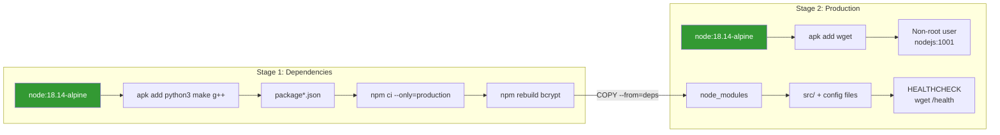
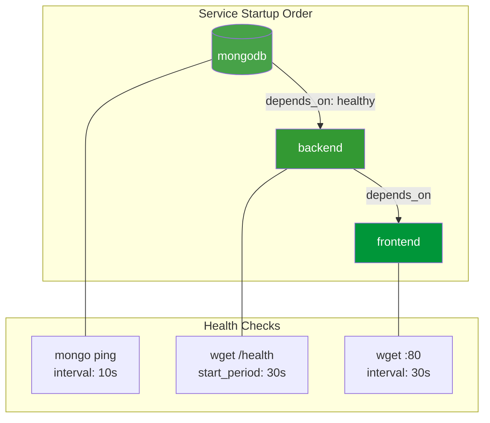
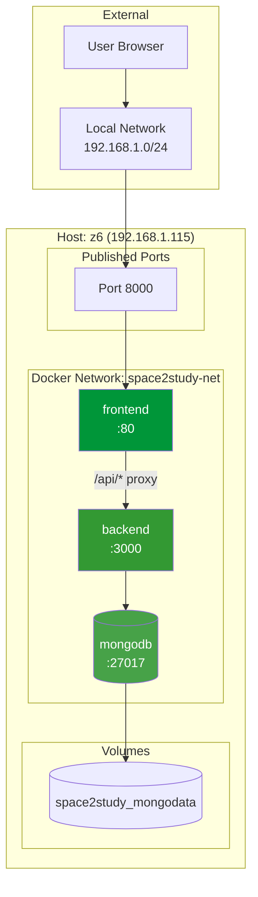
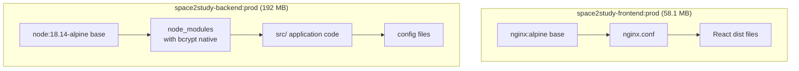
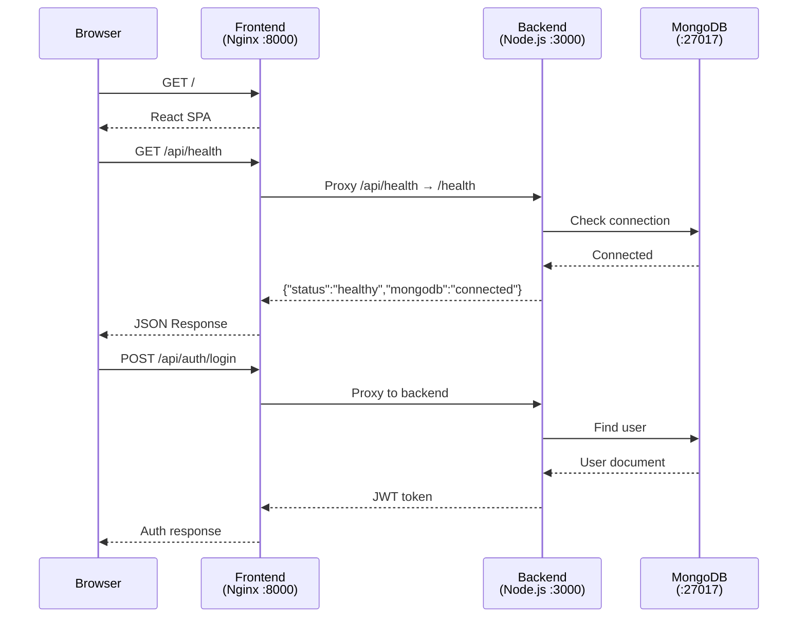

# Task 2: Deploying a Containerized Web Application - Completion Report

**Project:** Space2Study
**Status:** ✅ VERIFIED COMPLETE
**Date:** January 6, 2026 (Verified: January 11, 2026)
**Environment:** z6 workstation (192.168.1.115)

---

## Deliverables Created

| File | Location | Purpose |
|------|----------|---------|
| Dockerfile (backend) | `space2study-backend/Dockerfile` | Multi-stage Node.js production build |
| Dockerfile (frontend) | `space2study-frontend/Dockerfile` | Multi-stage build with Nginx |
| nginx.conf | `space2study-frontend/nginx.conf` | SPA routing, API proxy, security headers |
| .dockerignore (backend) | `space2study-backend/.dockerignore` | Exclude dev files from build |
| .dockerignore (frontend) | `space2study-frontend/.dockerignore` | Exclude dev files from build |
| docker-compose.prod.yml | `docker-compose.prod.yml` | Production orchestration |
| .env.prod.example | `.env.prod.example` | Environment variable template |
| Health endpoint | `src/initialization/initialization.js` | Container health checks |

## Production Architecture

```mermaid
graph TB
    subgraph "Docker Compose Production Stack"
        subgraph "Frontend Container"
            NGINX[Nginx:alpine<br/>Port 80]
            STATIC[Static React Assets<br/>/usr/share/nginx/html]
        end

        subgraph "Backend Container"
            NODE[Node.js 18.14-alpine<br/>Port 3000]
            HEALTH[/health endpoint]
        end

        subgraph "Database Container"
            MONGO[(MongoDB 4.2<br/>Port 27017)]
            VOLUME[(mongodb_data<br/>Volume)]
        end
    end

    USER[User Browser] --> NGINX
    NGINX --> STATIC
    NGINX -->|/api/*| NODE
    NODE --> MONGO
    MONGO --> VOLUME

    style NGINX fill:#009639,color:#fff
    style NODE fill:#339933,color:#fff
    style MONGO fill:#47A248,color:#fff
```

## Multi-Stage Build Architecture

### Backend Dockerfile (Node.js)



### Frontend Dockerfile (React/Nginx)

```mermaid
graph LR
    subgraph "Stage 1: Build"
        NODE[node:18-alpine]
        NPM[npm ci --legacy-peer-deps]
        ARG[ARG VITE_API_BASE_PATH]
        BUILD[npm run build]
        DIST[dist/*]
    end

    subgraph "Stage 2: Production"
        NGX[nginx:alpine]
        STATIC[/usr/share/nginx/html]
        CONF[nginx.conf]
        HEALTH[HEALTHCHECK<br/>wget localhost:80]
    end

    NODE --> NPM
    NPM --> ARG
    ARG --> BUILD
    BUILD --> DIST
    DIST -->|COPY --from=build| STATIC
    NGX --> STATIC
    CONF --> NGX
    NGX --> HEALTH

    style NODE fill:#339933,color:#fff
    style NGX fill:#009639,color:#fff
```

## Docker Compose Service Dependencies



## Network Topology



## Container Image Layers



## Request Flow



## Build Results

| Image | Size | Build Time | Status |
|-------|------|------------|--------|
| space2study-frontend:prod | 58.1 MB | ~45s | ✅ Built & Verified |
| space2study-backend:prod | 192 MB | ~60s | ✅ Built & Verified |

## Production Stack Verification (January 11, 2026)

All containers started and verified healthy:

| Container | Status | Health Check |
|-----------|--------|--------------|
| space2study-frontend | Up (healthy) | HTTP 200 on port 8000 |
| space2study-backend | Up (healthy) | /health endpoint responding |
| space2study-mongodb | Up (healthy) | MongoDB ping |

```bash
# Verification performed:
curl -s -o /dev/null -w "%{http_code}" http://localhost:8000  # 200

curl http://localhost:8000/api/health
# {"status":"healthy","timestamp":"2026-01-11T21:53:23.240Z","uptime":38.42,"mongodb":"connected"}
```

## Key Implementation Details

### Backend Dockerfile Features
- Multi-stage build (deps -> production)
- Production-only dependencies (`--only=production`)
- Skip husky install (`--ignore-scripts`)
- Non-root user (nodejs:1001)
- Health check with wget
- 30s startup period for Node.js initialization

### Frontend Dockerfile Features
- Multi-stage build (build -> nginx)
- Legacy peer deps for React compatibility (`--legacy-peer-deps`)
- Build-time API URL configuration via ARG
- Nginx alpine for minimal footprint
- Health check on port 80

### Health Endpoint Added

```javascript
app.get('/health', (_req, res) => {
  res.json({
    status: 'healthy',
    timestamp: new Date().toISOString(),
    uptime: process.uptime(),
    mongodb: mongoose.connection.readyState === 1 ? 'connected' : 'disconnected'
  })
})
```

## Issues Resolved

| Issue | Solution |
|-------|----------|
| npm peer dependency conflict | Added `--legacy-peer-deps` flag |
| husky install failure in container | Added `--ignore-scripts` flag |
| No health check endpoint | Created `/health` route in initialization.js |
| bcrypt native binding missing on Alpine | Added build tools (python3, make, g++) and `npm rebuild bcrypt --build-from-source` |
| swagger-settings module not found | Added `COPY swagger-settings.js ./` to Dockerfile |

### bcrypt Fix Details

The bcrypt package requires native bindings that must be compiled for the target platform (Alpine Linux). The fix required:

```dockerfile
# Stage 1: Install dependencies
FROM node:18.14-alpine AS deps
WORKDIR /app

# Install build tools for native modules (bcrypt)
RUN apk add --no-cache python3 make g++

# Install and rebuild bcrypt
RUN npm ci --only=production --ignore-scripts && \
    npm rebuild bcrypt --build-from-source && \
    npm cache clean --force
```

## Verification Commands

```bash
# Build production images
docker build -t space2study-frontend:prod ./space2study-frontend
docker build -t space2study-backend:prod ./space2study-backend

# Create .env.prod from template
cp .env.prod.example .env.prod
# Edit .env.prod with actual values

# Run full stack
docker compose -f docker-compose.prod.yml --env-file .env.prod up -d

# Check container status
docker compose -f docker-compose.prod.yml ps

# Test health endpoint (via nginx proxy)
curl http://localhost:8000/api/health

# Stop stack
docker compose -f docker-compose.prod.yml down

# Stop and remove volumes (clean restart)
docker compose -f docker-compose.prod.yml down -v
```

## Next Steps

- Task 3: Infrastructure as Code (Terraform/CloudFormation)
- Consider adding GitHub Actions for automated builds
- Set up container registry for image storage
