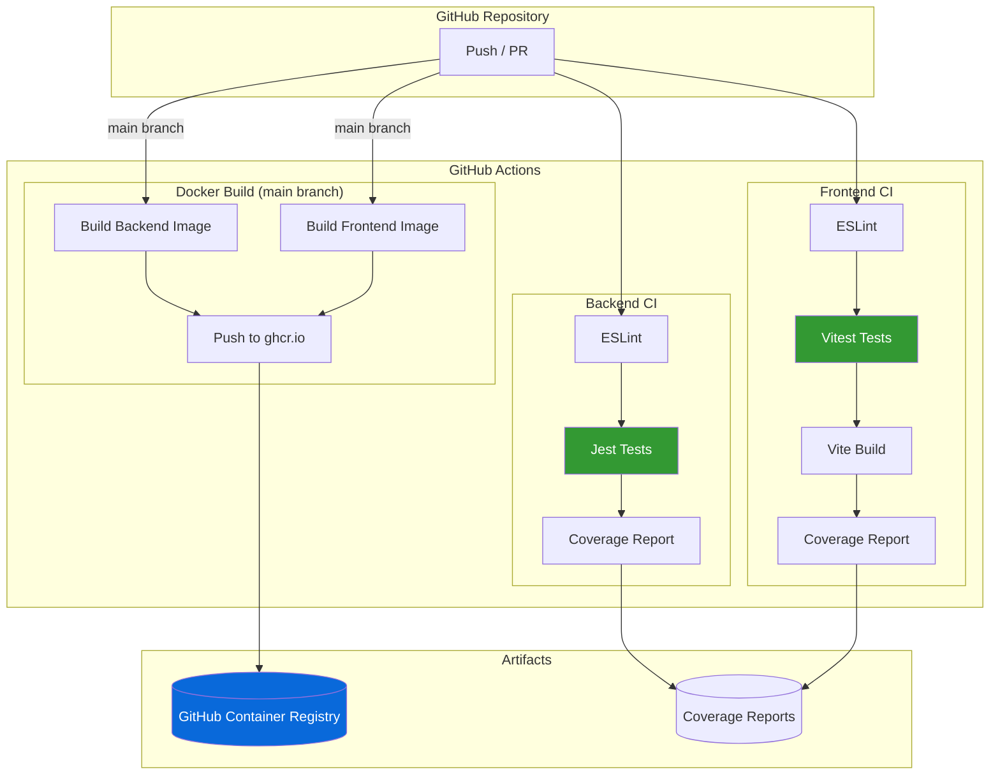

# Task 4: CI/CD Implementation - Completion Report

**Project:** Space2Study
**Status:** IMPLEMENTED
**Date:** January 11, 2026
**Environment:** GitHub Actions + GitHub Container Registry

---

## Deliverables Created

| File | Location | Purpose |
|------|----------|---------|
| Backend CI workflow | `space2study-backend/.github/workflows/ci.yml` | Jest tests, lint, coverage |
| Frontend CI workflow | `space2study-frontend/.github/workflows/ci.yml` | Vitest tests, lint, build |
| Docker build workflow | `.github/workflows/docker.yml` | Build & push to ghcr.io |

---

## CI/CD Architecture



---

## Workflow Details

### Backend CI (`space2study-backend/.github/workflows/ci.yml`)

**Triggers:** Push, Pull Request (all branches)

**Jobs:**
1. **test** - Run tests with MongoDB service
   - Checkout code
   - Setup Node.js 18
   - Install dependencies (`npm ci`)
   - Run linter (`npm run lint`)
   - Run tests (`npm test`) with MongoDB service container
   - Upload coverage artifact

**Services:**
- MongoDB 4.2 on port 27017

**Environment Variables:**
```yaml
MONGODB_URL: mongodb://localhost:27017/space2study-test
SERVER_PORT: 3000
JWT_ACCESS_SECRET: test-access-secret
JWT_ACCESS_EXPIRES_IN: 15m
JWT_REFRESH_SECRET: test-refresh-secret
JWT_REFRESH_EXPIRES_IN: 7d
JWT_RESET_SECRET: test-reset-secret
JWT_RESET_EXPIRES_IN: 1h
JWT_CONFIRM_SECRET: test-confirm-secret
JWT_CONFIRM_EXPIRES_IN: 24h
```

---

### Frontend CI (`space2study-frontend/.github/workflows/ci.yml`)

**Triggers:** Push, Pull Request (all branches)

**Jobs:**
1. **test** - Run tests
   - Checkout code
   - Setup Node.js 18
   - Install dependencies (`npm ci --legacy-peer-deps`)
   - Run linter (`npm run lint`)
   - Run tests (`npm test`)
   - Upload coverage artifact

2. **build** - Build production assets (after test passes)
   - Checkout code
   - Setup Node.js 18
   - Install dependencies
   - Build application (`npm run build`)
   - Upload build artifacts

---

### Docker Build (`.github/workflows/docker.yml`)

**Triggers:** Push to main/master, Manual dispatch

**Jobs:**
1. **build-backend** - Build and push backend image
   - Uses Docker Buildx for efficient builds
   - Pushes to `ghcr.io/<owner>/space2study-backend`
   - Tags: `latest`, `<git-sha>`
   - Uses GitHub Actions cache

2. **build-frontend** - Build and push frontend image
   - Uses Docker Buildx
   - Pushes to `ghcr.io/<owner>/space2study-frontend`
   - Tags: `latest`, `<git-sha>`
   - Build arg: `VITE_API_BASE_PATH=/api`

---

## Container Registry

**Registry:** GitHub Container Registry (ghcr.io)

**Images:**
```
ghcr.io/<owner>/space2study-backend:latest
ghcr.io/<owner>/space2study-backend:<sha>
ghcr.io/<owner>/space2study-frontend:latest
ghcr.io/<owner>/space2study-frontend:<sha>
```

**Authentication:** Uses built-in `GITHUB_TOKEN` (no extra secrets needed)

---

## Verification Commands

```bash
# Check workflow files exist
ls -la space2study-backend/.github/workflows/
ls -la space2study-frontend/.github/workflows/
ls -la .github/workflows/

# Validate YAML syntax
yamllint space2study-backend/.github/workflows/ci.yml
yamllint space2study-frontend/.github/workflows/ci.yml
yamllint .github/workflows/docker.yml

# Test locally (requires act)
# act push -W space2study-backend/.github/workflows/ci.yml
```

---

## Activation Steps

To activate CI/CD pipelines:

1. **Push workflows to GitHub:**
   ```bash
   cd space2study-backend
   git add .github/workflows/ci.yml
   git commit -m "Add CI workflow"
   git push

   cd ../space2study-frontend
   git add .github/workflows/ci.yml
   git commit -m "Add CI workflow"
   git push

   cd ..
   git add .github/workflows/docker.yml
   git commit -m "Add Docker build workflow"
   git push
   ```

2. **Verify on GitHub:**
   - Go to repository → Actions tab
   - Check workflow runs
   - Fix any issues shown in logs

3. **(Optional) Enable branch protection:**
   - Settings → Branches → Add rule
   - Require status checks to pass before merging

---

## Next Steps

- [x] Push workflows to GitHub repositories
- [ ] Verify CI workflows pass
- [ ] Verify Docker builds complete
- [ ] Enable branch protection rules
- [ ] (Optional) Add SonarCloud integration
- [ ] Task 5: Load Balancing

---

## Fixes Applied

### Backend CI Fix (January 12, 2026)

**Issue:** CI workflow failing with two errors:
1. `Cannot find module 'bcrypt/lib/binding/napi-v3/bcrypt_lib.node'`
2. `"expiresIn" should be a number of seconds or string representing a timespan`

**Root Cause:**
1. `npm ci --ignore-scripts` prevented bcrypt from compiling native bindings
2. JWT expiration environment variables were missing (only secrets were set)

**Solution:**
```diff
- run: npm ci --ignore-scripts
+ run: npm ci

  env:
    JWT_ACCESS_SECRET: test-access-secret
+   JWT_ACCESS_EXPIRES_IN: 15m
    JWT_REFRESH_SECRET: test-refresh-secret
+   JWT_REFRESH_EXPIRES_IN: 7d
    JWT_RESET_SECRET: test-reset-secret
+   JWT_RESET_EXPIRES_IN: 1h
    JWT_CONFIRM_SECRET: test-confirm-secret
+   JWT_CONFIRM_EXPIRES_IN: 24h
```

**Commit:** `dc764b6` - Fix CI workflow: bcrypt bindings and JWT expiration
