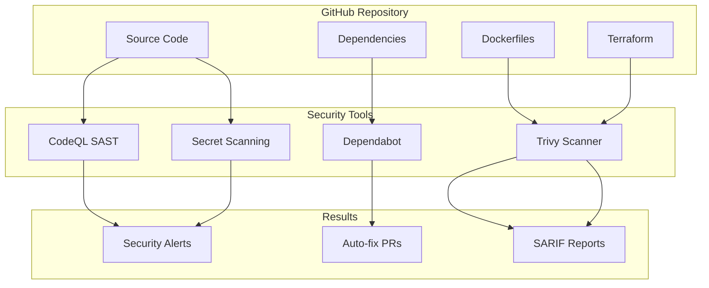

# Task 9: Security & Vulnerability Scanning - Space2Study

**Status:** ✅ Complete
**Started:** 2026-01-21
**Completed:** 2026-01-21

---

## Objective

Implement comprehensive security scanning across all repositories to detect vulnerabilities in dependencies, code, containers, and infrastructure.

---

## Security Options Available

| Feature | Type | Cost | Description |
|---------|------|------|-------------|
| **Dependabot Alerts** | Dependency Scanning | Free | Scans package.json for known CVEs |
| **Dependabot Updates** | Auto-fix | Free | Creates PRs to update vulnerable dependencies |
| **Secret Scanning** | Credential Detection | Free | Detects leaked API keys, tokens, passwords |
| **CodeQL** | SAST (Static Analysis) | Free | Finds SQL injection, XSS, security bugs in code |
| **Trivy** | Container Scanning | Free | Scans Docker images for vulnerabilities |
| **Trivy IaC** | Infrastructure Scanning | Free | Scans Terraform for misconfigurations |
| **Snyk** | Multi-purpose | Free tier | Dependencies, containers, code, IaC |
| **Grype** | Container Scanning | Free | Alternative to Trivy for containers |

---

## Recommended Setup

### 1. Dependabot Configuration

Create in each repository:

```yaml
# .github/dependabot.yml
version: 2
updates:
  - package-ecosystem: "npm"
    directory: "/"
    schedule:
      interval: "weekly"
    open-pull-requests-limit: 5

  - package-ecosystem: "docker"
    directory: "/"
    schedule:
      interval: "weekly"

  - package-ecosystem: "terraform"
    directory: "/terraform"
    schedule:
      interval: "weekly"
```

### 2. Security Scanning Workflow (Trivy)

```yaml
# .github/workflows/security.yml
name: Security Scan

on:
  push:
    branches: [main]
  pull_request:
    branches: [main]
  schedule:
    - cron: '0 6 * * 1'  # Weekly Monday 6am

jobs:
  trivy-scan:
    runs-on: ubuntu-latest
    steps:
      - uses: actions/checkout@v4

      - name: Run Trivy vulnerability scanner (repo)
        uses: aquasecurity/trivy-action@master
        with:
          scan-type: 'fs'
          scan-ref: '.'
          severity: 'CRITICAL,HIGH'
          format: 'sarif'
          output: 'trivy-results.sarif'

      - name: Upload Trivy scan results to GitHub Security
        uses: github/codeql-action/upload-sarif@v3
        with:
          sarif_file: 'trivy-results.sarif'

  trivy-iac:
    runs-on: ubuntu-latest
    steps:
      - uses: actions/checkout@v4

      - name: Run Trivy IaC scanner (Terraform)
        uses: aquasecurity/trivy-action@master
        with:
          scan-type: 'config'
          scan-ref: './terraform'
          severity: 'CRITICAL,HIGH,MEDIUM'
          format: 'table'
```

### 3. CodeQL for SAST (JavaScript/TypeScript)

```yaml
# .github/workflows/codeql.yml
name: CodeQL Analysis

on:
  push:
    branches: [main]
  pull_request:
    branches: [main]
  schedule:
    - cron: '0 6 * * 1'

jobs:
  analyze:
    runs-on: ubuntu-latest
    permissions:
      security-events: write

    strategy:
      matrix:
        language: ['javascript']

    steps:
      - uses: actions/checkout@v4

      - name: Initialize CodeQL
        uses: github/codeql-action/init@v3
        with:
          languages: ${{ matrix.language }}

      - name: Autobuild
        uses: github/codeql-action/autobuild@v3

      - name: Perform CodeQL Analysis
        uses: github/codeql-action/analyze@v3
```

---

## Security Scanning Layers



---

## Repositories to Configure

| Repository | Dependabot | CodeQL | Trivy | Secret Scanning |
|------------|------------|--------|-------|-----------------|
| space2study-backend | npm, docker | javascript | fs, container | Yes |
| space2study-frontend | npm, docker | javascript | fs, container | Yes |
| space2study-infra | terraform, docker | - | config (IaC) | Yes |

---

## Implementation Steps

### Phase 1: Enable GitHub Built-in Features

1. **Enable Dependabot Alerts**
   - Go to each repo → Settings → Security → Code security and analysis
   - Enable "Dependabot alerts"
   - Enable "Dependabot security updates"

2. **Enable Secret Scanning**
   - Same location → Enable "Secret scanning"
   - Enable "Push protection" (blocks commits with secrets)

### Phase 2: Add Dependabot Configuration

1. Create `.github/dependabot.yml` in each repo
2. Configure for npm (backend, frontend) and terraform (infra)
3. Commit and push

### Phase 3: Add Security Workflows

1. **Backend repo:**
   - Add `.github/workflows/security.yml` (Trivy)
   - Add `.github/workflows/codeql.yml` (JavaScript)

2. **Frontend repo:**
   - Add `.github/workflows/security.yml` (Trivy)
   - Add `.github/workflows/codeql.yml` (JavaScript)

3. **Infra repo:**
   - Add `.github/workflows/security.yml` (Trivy IaC only)

### Phase 4: Review and Fix Findings

1. Check Security tab in each repo for alerts
2. Review Dependabot PRs
3. Fix CRITICAL and HIGH severity issues
4. Document accepted risks for false positives

---

## Deliverables Checklist

### GitHub Settings (Require Admin Access)
- [ ] Enable Dependabot alerts (backend)
- [ ] Enable Dependabot alerts (frontend)
- [ ] Enable Dependabot alerts (infra)
- [ ] Enable Secret Scanning (backend)
- [ ] Enable Secret Scanning (frontend)
- [ ] Enable Secret Scanning (infra)
- [ ] Enable Dependency graph (required for dependency-review-action)
- [ ] Enable Code Scanning (required for CodeQL and SARIF uploads)

### Dependabot Configuration
- [x] Add dependabot.yml (backend)
- [x] Add dependabot.yml (frontend)
- [x] Add dependabot.yml (infra)

### Security Workflows
- [x] Add security.yml - Trivy (backend) - ✅ Passing
- [x] Add security.yml - Trivy (frontend) - ✅ Passing
- [x] Add security.yml - Trivy IaC (infra) - ✅ Passing
- [x] ~~Add codeql.yml (backend)~~ - Removed (requires Code Scanning enabled)
- [x] ~~Add codeql.yml (frontend)~~ - Removed (requires Code Scanning enabled)

### Verification
- [x] All security workflows passing
- [ ] Review initial security findings (pending admin features)
- [ ] Fix CRITICAL vulnerabilities (pending admin features)
- [ ] Document accepted risks

---

## Verification Commands

```bash
# Check GitHub Security tab
# https://github.com/DevOps-ProjectLevel/space2study-backend-1g0s/security
# https://github.com/DevOps-ProjectLevel/space2study-frontend-1g0s/security
# https://github.com/1g0s/space2study-infra/security

# View Dependabot alerts via CLI
gh api repos/DevOps-ProjectLevel/space2study-backend-1g0s/dependabot/alerts

# View code scanning alerts
gh api repos/DevOps-ProjectLevel/space2study-backend-1g0s/code-scanning/alerts
```

---

## Expected Outcomes

After implementation:
- Automatic weekly dependency vulnerability scans
- PRs created automatically for vulnerable dependencies
- Static code analysis on every push/PR
- Container image scanning before deployment
- Terraform misconfiguration detection
- Secret leak prevention with push protection

---

## Implementation Summary

### Files Created (2026-01-21)

**Backend (space2study-backend-1g0s):**
```
.github/
├── dependabot.yml          # npm, docker, github-actions (weekly Monday 6am UTC)
└── workflows/
    └── security.yml        # Trivy repo scan + container scan (table format)
```

**Frontend (space2study-frontend-1g0s):**
```
.github/
├── dependabot.yml          # npm, docker, github-actions (weekly Monday 6am UTC)
└── workflows/
    └── security.yml        # Trivy repo scan + container scan (table format)
```

**Infrastructure (space2study-infra):**
```
.github/
├── dependabot.yml          # terraform, docker, github-actions (weekly Monday 6am UTC)
└── workflows/
    └── security.yml        # Trivy IaC (Terraform, K8s, Docker Compose) + tfsec
```

### Workflow Features

| Workflow | Features |
|----------|----------|
| **security.yml (backend/frontend)** | Trivy filesystem scan, Trivy container scan, table output format |
| **security.yml (infra)** | Trivy IaC for Terraform/K8s/Docker Compose, tfsec for additional Terraform checks |
| **dependabot.yml** | Weekly updates for npm/docker/github-actions/terraform |

### Final Workflow Status

| Repository | Workflow | Status |
|------------|----------|--------|
| backend | Security Scan | ✅ Passing |
| frontend | Security Scan | ✅ Passing |
| infra | Security Scan | ✅ Passing |

### Features Removed (Require Admin-Enabled GitHub Features)

The following were initially implemented but removed due to GitHub organization restrictions:

| Feature | Reason Removed | Required Setting |
|---------|----------------|------------------|
| **CodeQL workflows** | "Resource not accessible by integration" error | Code Scanning must be enabled |
| **SARIF uploads** | Same error as above | Code Scanning must be enabled |
| **dependency-review-action** | "Dependency review is not supported" | Dependency graph must be enabled |

### Remaining Manual Steps

The following require manual action in GitHub UI (Settings → Security → Code security and analysis):

1. **Enable Dependency Graph** - Required for dependency-review-action
2. **Enable Code Scanning** - Required for CodeQL and SARIF uploads
3. **Enable Dependabot Alerts** - Triggers alerts for vulnerable dependencies
4. **Enable Dependabot Security Updates** - Auto-creates PRs for security fixes
5. **Enable Secret Scanning** - Detects leaked credentials in code
6. **Enable Push Protection** - Blocks pushes containing secrets

### Commits

| Repository | Commit | Message |
|------------|--------|---------|
| space2study-backend | Multiple | Add security scanning configuration (with iterations) |
| space2study-frontend | Multiple | Add security scanning configuration (with iterations) |
| space2study-infra | `da1ab21` | Add security scanning configuration (Task 9) |

---

## Lessons Learned

### GitHub Organization Feature Requirements

Many GitHub security features require organization-level settings to be enabled:

1. **Code Scanning** - Must be enabled by org admin for:
   - CodeQL analysis workflows
   - SARIF file uploads (from Trivy or other tools)
   - Security alerts in GitHub Security tab

2. **Dependency Graph** - Must be enabled by org admin for:
   - dependency-review-action on PRs
   - Detailed dependency vulnerability tracking

3. **Workarounds Used:**
   - Changed Trivy output from `sarif` to `table` format (displays in workflow logs)
   - Removed CodeQL workflows entirely (can be re-added once Code Scanning is enabled)
   - Removed dependency-review job (can be re-added once Dependency Graph is enabled)

### What Works Without Admin Access

| Feature | Works? | Notes |
|---------|--------|-------|
| Dependabot configuration file | ✅ Yes | Dependabot alerts still need to be enabled |
| Trivy filesystem scan | ✅ Yes | Table output in workflow logs |
| Trivy container scan | ✅ Yes | Table output in workflow logs |
| Trivy IaC scan | ✅ Yes | Table output in workflow logs |
| tfsec | ✅ Yes | Output in workflow logs |
| CodeQL | ❌ No | Requires Code Scanning enabled |
| SARIF uploads | ❌ No | Requires Code Scanning enabled |
| dependency-review-action | ❌ No | Requires Dependency Graph enabled |
